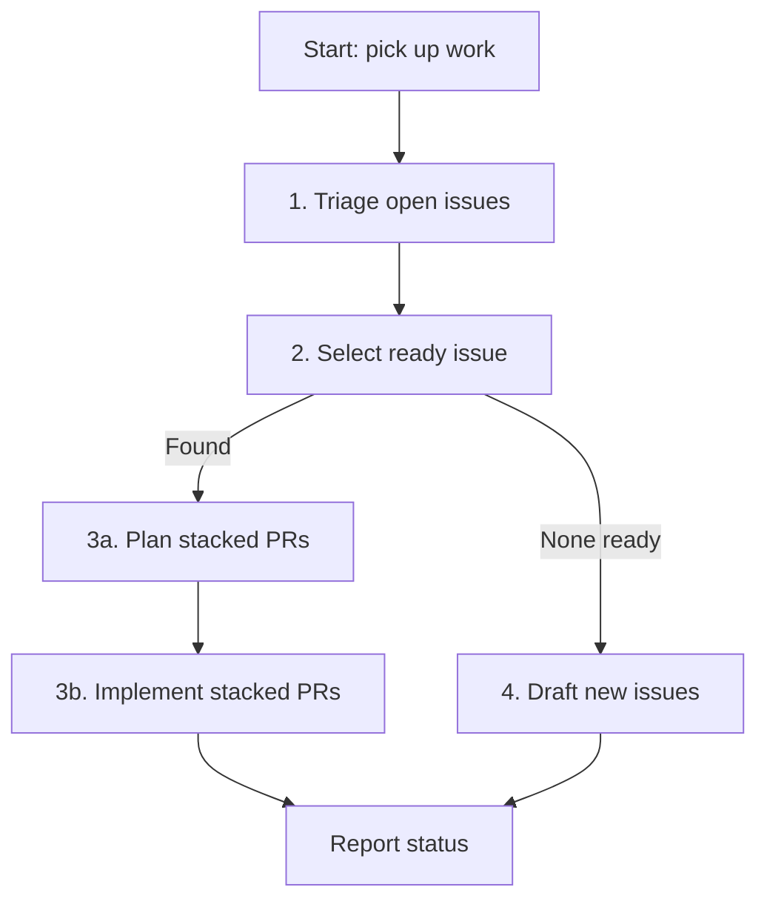

# Pick Up Work Item

Use this skill when the user wants you to **find and start the next piece of
migration work** — not to review or land an existing PR.

This repo tracks work on **GitHub Issues** with draft specs in
[`docs/rust-migration/issues/`](../../docs/rust-migration/issues/README.md).
Each implementable child targets **~200 lines** of meaningful change.

## Workflow overview

Run these steps **in order**. Do not skip ahead.

| Step | Subskill | Outcome |
|------|----------|---------|
| 1 | [`triage-open-issues`](../triage-open-issues/SKILL.md) | Close issues that are already done but still open |
| 2 | [`select-ready-issue`](../select-ready-issue/SKILL.md) | Pick one open, unblocked, ready issue — or report none |
| 3a | [`plan-stacked-prs`](../plan-stacked-prs/SKILL.md) | Split the issue into ~200 LOC stacked PRs (plan only) |
| 3b | [`implement-stacked-prs`](../implement-stacked-prs/SKILL.md) | Implement PRs one by one, open stacked PRs |
| 4 | [`draft-migration-issues`](../draft-migration-issues/SKILL.md) | **Only if step 2 found nothing ready** — draft new tickets |

## Boundaries

| Do | Do not |
|----|--------|
| Triage, select, plan, implement, or draft issues | Review someone else's PR (`pr-review-delivery`) |
| Close issues with evidence they are done | Merge PRs without explicit user instruction |
| Open stacked PRs for the selected issue | Pick up a second issue while the first stack is in flight (unless user asks) |
| Update `docs/rust-migration/issues/README.md` status when closing issues | Rewrite `ISSUE-MAP.md` by hand (use `file-issues.sh`) |

## Repo context (quick reference)

- **Issue map:** [`ISSUE-MAP.md`](../../docs/rust-migration/issues/ISSUE-MAP.md) — draft ID ↔ GitHub `#N`
- **Status table:** [`README.md`](../../docs/rust-migration/issues/README.md) — local done/draft/in-progress tracking
- **Epics:** `epic-*.md` — wave/phase parents (`E01`–`E12`)
- **Children:** `wave*`, `test-*`, `arch-*`, `release-*` — sized ~200 LOC slices
- **Labels:** `rust-migration`, `wave-*`, `phase-*`, `size/~200`
- **Gates:** L0 build, L1 symbols, L2 host tests, L3 QEMU, L4 hardware — see [`test-plan.md`](../../docs/rust-migration/test-plan.md) and [`AGENTS.md`](../../AGENTS.md)

## Final status report

After completing the applicable steps, reply in chat with:

| Item | Value |
|------|-------|
| Triage | Issues closed (list `#N` + reason) or "none" |
| Selected issue | Draft ID, GitHub `#N`, title — or "none ready" |
| Plan | PR stack table (branch, scope, ~LOC, gates) — if planned |
| Implementation | PR links opened, current stack position — if implemented |
| New drafts | Files created / issues filed — if step 4 ran |

Ask the user before starting implementation if they only wanted triage or selection.

## Relationship to other skills

| Skill | When |
|-------|------|
| **`plan-stacked-prs`** | Before writing code — produces the PR breakdown |
| **`implement-stacked-prs`** | After plan approval — builds and opens stacked PRs |
| **`prepare-pr-for-merge`** | Later — when a stack PR is ready to land on `master` |
| **`pr-review-delivery`** | Reviewer role only — not part of this workflow |
