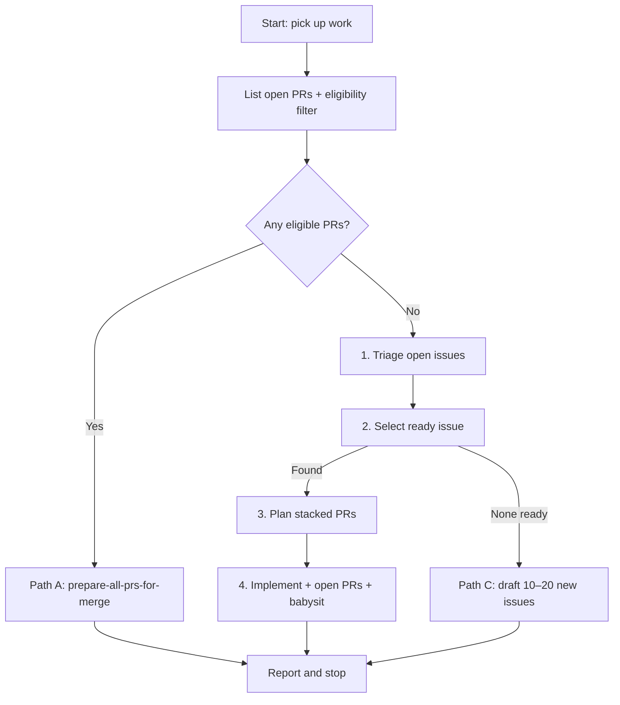

# Pick Up Work Item

Use this skill when the user wants you to **do the next right thing** for the
rust-migration — prepare existing PRs, start new implementation, or refill the
issue backlog.

**Choose exactly one path per invocation.** Do not chain paths in a single run
(e.g. do not prepare PRs and then implement a new issue in the same session).

This repo tracks work on **GitHub Issues** with draft specs in
[`docs/rust-migration/issues/`](../../../docs/rust-migration/issues/README.md).
Each implementable child targets **~200 lines** of meaningful change.

## Path selection (mandatory — run first)

Before triage, planning, or implementation, list open PRs and apply the same
**eligibility filter** as [`prepare-all-prs-for-merge`](../prepare-all-prs-for-merge/SKILL.md#phase-1--discover-and-filter-prs) Phase 1:

```bash
gh pr list --state open --json number,title,isDraft,baseRefName,headRefName,url
```

For each PR, include it in **`eligible`** only if `baseRefName` is `master`, or
that base branch is already merged into `master` (see prepare-all-prs Phase 1).
All other open PRs go in **`skipped`** (stacked on an unmerged parent).

| Condition | Path | Action |
|-----------|------|--------|
| **One or more eligible open PRs** (includes drafts — GitHub lists drafts under `--state open`) | **A — Prepare PRs** | Run [`prepare-all-prs-for-merge`](../prepare-all-prs-for-merge/SKILL.md), then **stop** |
| **No eligible PRs** (no open PRs, or every open PR is `skipped`) and a ready issue exists after triage + selection | **B — New work** | Triage → select → plan → implement → open PRs → babysit, then **stop** |
| **No eligible PRs** and no ready issue after triage + selection | **C — Draft wave** | Triage → draft 10–20 new issues, then **stop** |

When open PRs exist but **`eligible` is empty** (all `skipped`), **fall through**
to Path B or C — do not enter Path A with nothing to prepare. Note the skipped
PRs and blocking parents in the final report.



Announce which path you chose in chat (one line), e.g. "Path A — 2 eligible
open PRs; running prepare-all-prs-for-merge" or "Path B — 1 open PR skipped
(unmerged parent); no eligible PRs."

## Path A — Prepare all PRs

**When:** path selection found at least one **eligible** open PR (see above).

Load and follow [`prepare-all-prs-for-merge`](../prepare-all-prs-for-merge/SKILL.md)
in full:

1. Filter to PRs whose base is `master` or whose base branch is merged into
   `master` (should match path-selection `eligible` list).
2. Mark eligible drafts ready for review (`gh pr ready`).
3. Run [`prepare-pr-for-merge`](../prepare-pr-for-merge/SKILL.md) on each
   eligible PR (babysit until CI green and reviews complete).

**Stop here.** Do not triage issues, implement new work, or draft tickets in
the same run.

### Path A blocked — human action required

Path A intentionally prioritizes PR prep over new work. When one or more
**eligible** PRs cannot reach "ready to merge" after prepare (unresolved
requested-changes review, flaky CI exhausted, ambiguous stack, needs a human
decision, etc.):

1. Report each blocker clearly in the final status table (`Ready?` = no, with
   notes).
2. End the run with status **`human action required`** — do not imply the next
   pick-up will automatically unblock the PR.
3. The **next** pick-up will re-enter Path A while those eligible PRs remain
   open (by design).

**User override:** if the user explicitly asks to skip PR prep and start new
work (e.g. "pick up work, ignore open PRs", "start Path B"), honor that and
run Path B or C instead. Note in the report which open PRs were deprioritized.

## Path B — Implement the next ready issue

**When:** no open PRs, and [`select-ready-issue`](../select-ready-issue/SKILL.md)
finds an unblocked issue after triage.

| Step | Subskill | Outcome |
|------|----------|---------|
| 1 | [`triage-open-issues`](../triage-open-issues/SKILL.md) | Close issues already done but still open |
| 2 | [`select-ready-issue`](../select-ready-issue/SKILL.md) | Pick one open, unblocked, ready issue |
| 3 | [`plan-stacked-prs`](../plan-stacked-prs/SKILL.md) | Split into ~200 LOC stacked PRs (plan only) |
| 4 | [`implement-stacked-prs`](../implement-stacked-prs/SKILL.md) | Implement, open PRs **ready for review** (not draft), babysit |

### Open state + babysit (Path B only)

New PRs from this path must land in **open** (ready-for-review) state — not
draft:

- `ManagePullRequest` `create_pr` with `draft: false` (default).
- `gh pr create` without `--draft`.
- If a PR was opened as draft by mistake: `gh pr ready <number>`.

After the stack is opened, **babysit** until CI is green on the opened PRs:

1. Load Cursor's built-in **`babysit`** skill when available; otherwise apply its
   intent manually (fix CI, address blocking review feedback, push, re-poll).
2. Poll `gh pr checks` until required checks pass.
3. Do **not** start Path A (`prepare-all-prs-for-merge`) in the same run — the
   PRs you just opened will be handled on the **next** pick-up when Path A
   triggers.

**Stop here** after the stack is implemented and babysitted (or blocked with a
clear report). Do not draft new issues in the same run.

## Path C — Draft a new wave

**When:** no open PRs, and step 2 finds **no** ready issue.

| Step | Subskill | Outcome |
|------|----------|---------|
| 1 | [`triage-open-issues`](../triage-open-issues/SKILL.md) | Close stale issues (same as Path B) |
| 2 | [`draft-migration-issues`](../draft-migration-issues/SKILL.md) | Draft **10–20** new ~200 LOC tickets, then **stop** |

Path C is a **complete job** — not a prelude to implementation.

| After Path C | Do | Do not |
|--------------|-----|--------|
| Issues drafted and/or filed | Report what was created, what it unblocks, and any human decisions needed | Re-run selection to implement a new issue |
| User asked only to draft/file issues | Commit/push draft markdown and `ISSUE-MAP.md` updates; open a docs PR if appropriate | Continue to `plan-stacked-prs` or `implement-stacked-prs` |
| Newly filed issues look ready | Note them for a **future** pick-up (Path B) | Start planning or coding in the same session |

Do **not** treat "nothing was ready, so I filed new tickets" as permission to
implement one immediately. Wait for an explicit follow-up or a new pick-up run
(Path A will apply once PRs exist).

## Boundaries

| Do | Do not |
|----|--------|
| Choose **one** path per run and complete it | Chain Path A + B, or B + C, in one session |
| Prefer Path A when **eligible** PRs are open | Start new implementation while eligible PRs need prep |
| Fall through to B/C when open PRs are all `skipped` | Enter Path A with zero eligible PRs |
| Report `human action required` when eligible PRs stay blocked | Imply the next pick-up will fix blocked PRs automatically |
| Honor explicit user override to skip PR prep | Ignore a clear "start new work" instruction |
| Open new PRs ready for review (Path B) | Open implementation PRs as drafts |
| Babysit new PRs until CI is green (Path B) | Skip babysit after opening a stack |
| Draft 10–20 issues when frontier is empty (Path C) | Draft only 1–2 tickets when a tranche is missing |
| Close issues with evidence they are done | Merge PRs without explicit user instruction |
| Query GitHub for open PRs, issues, blocked state | Rewrite `ISSUE-MAP.md` by hand (use `file-issues.sh`) |

## Repo context (quick reference)

- **Tracker (authoritative):** GitHub Issues — `gh issue list` / `gh issue view`
- **Filing registry:** [`ISSUE-MAP.md`](../../../docs/rust-migration/issues/ISSUE-MAP.md) — draft ID ↔ GitHub `#N` (not status)
- **Draft specs:** `wave*`, `test-*`, `arch-*`, `release-*` — templates for filing (~200 LOC)
- **Epics:** `epic-*.md` — wave/phase planning structure (`E01`–`E12`)
- **Labels:** `rust-migration`, `wave-*`, `phase-*`, `size/~200`
- **Gates:** L0 build, L1 symbols, L2 host tests, L3 QEMU, L4 hardware — see [`test-plan.md`](../../../docs/rust-migration/test-plan.md) and [`AGENTS.md`](../../../AGENTS.md)

## Final status report

After completing **one** path, reply in chat with:

| Item | Value |
|------|-------|
| **Path chosen** | A (prepare PRs) / B (implement) / C (draft wave) |
| Open PRs at start | total / eligible / skipped — or "none" |
| Triage | Issues closed (`#N` + reason) or "none" / "n/a (Path A)" |
| Selected issue | Draft ID, GitHub `#N`, title — Path B only |
| Plan | PR stack table — Path B only |
| Implementation | PR links, babysit/CI status — Path B only |
| PR prep | Per-PR status from prepare-all — Path A only |
| New drafts | Files/issues created — Path C only |
| Workflow end | `prepared PRs` / `human action required` / `implemented` / `stopped after drafting` |

Ask the user before starting Path B implementation if they only wanted triage or
selection.

If Path C ran, **do not** ask whether to implement a new issue — the answer is
no unless the user sends a new, explicit instruction.

## Relationship to other skills

| Skill | When |
|-------|------|
| **`prepare-all-prs-for-merge`** | Path A — at least one eligible open/draft PR |
| **`prepare-pr-for-merge`** | Invoked inside Path A per eligible PR |
| **`plan-stacked-prs`** | Path B — before writing code |
| **`implement-stacked-prs`** | Path B — build, open (non-draft), babysit |
| **`draft-migration-issues`** | Path C — no ready work and no open PRs |
| **`pr-review-delivery`** | Reviewer role only — not part of this workflow |
