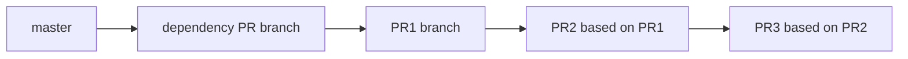

# Plan Stacked PRs

Turn one selected issue into a **stack of small, independently mergeable pull
requests**. Planning only — no code changes in this step.

## PR size limit (mandatory — read first)

**This is the most common planning failure.** Agents routinely open 400–600 line
PRs when the repo standard is **~200 lines per PR**. Treat the limit as a **hard
constraint**, not a suggestion.

| Rule | Value |
|------|-------|
| **Target** | ~200 changed lines per PR |
| **Hard maximum** | **250 changed lines** — never plan a PR above this |
| **If over max** | Add another PR to the stack; do not ship one large PR |

**How to measure (same check `implement-stacked-prs` runs before opening a PR):**

```bash
git add -A   # stage untracked files before measuring
# Merge-base → working tree (no ..HEAD): includes staged + unstaged changes
git diff --shortstat $(git merge-base HEAD origin/<base>)
# Example output:  12 files changed, 187 insertions(+), 42 deletions(-)
# Budget = insertions + deletions  →  187 + 42 = 229  (OK, under 250)
```

Count **insertions + deletions** against the PR's stack base (`master` for PR1,
previous PR branch for PR2+). This matches what reviewers see on GitHub.

**Plan-time estimation (before writing code):**

1. Skim the C/Rust files in scope; note function groups and line counts.
2. For **each planned PR**, list files and assign an **estimated Δ** (changed lines).
3. If a single PR's estimate exceeds **250**, split it — use the axes below.
4. If the **whole issue** estimates above 250, the stack has **at least 2 PRs**.
   A `size/~200` label or `estimate_loc: 200` on the issue does **not** mean
   "one PR" — it means one *slice*; oversized source still needs multiple PRs.

**Wrong vs right:**

| Wrong | Right |
|-------|-------|
| One 500-line PR for the whole issue | Stack of 3 PRs (~170 + ~190 + ~140) |
| "Tests + port + Makefile swap" in one PR | PR1 vectors, PR2 Rust port, PR3 Makefile swap |
| "I'll keep it small" with no LOC estimate | Every plan row has an estimated Δ ≤ 250 |
| Treating ~200 as "up to 600 is fine" | >250 is a planning bug — split again |

## Prerequisite: Plan mode (preferred)

**Use Cursor's Plan mode** for the breakdown when available:

1. Check your environment for Plan mode (mode switcher or `/plan`).
2. If available, switch to **Plan** and produce the PR stack there — focus on
   file-level scope, dependencies between PRs, and verification gates.
3. Confirm in chat: "Used Plan mode for PR breakdown" (or note if unavailable).

If Plan mode is **not** available, produce the same structured plan inline in
chat. Do not skip planning and jump to implementation.

## Split axes (use when estimate > 250)

From [`test-plan.md`](../../../docs/rust-migration/test-plan.md) and
[`issues/README.md`](../../../docs/rust-migration/issues/README.md):

- One logical slice per PR — do not mix unrelated units
- Default to **more PRs, smaller diffs** when unsure
- Re-split during implementation if the diff grows past 250 — return here

**Good split axes for this repo:**

| Pattern | Example |
|---------|---------|
| Harness / vectors first | L2 oracle before Rust port |
| Makefile object swap last | keep C + Rust parallel until final PR in slice |
| Part 1 / Part 2 | `aes-gcm-part1`, `aes-gcm-part2` (existing convention) |
| Domain types before port | `A2` helpers, then `W3-*` translation |
| FFI seam vs logic | bindgen/abi in one PR, algorithm in the next |

## Stack design

Each PR in the stack:

1. **Builds on the previous PR's branch** (not necessarily `master`) — chained for
   GitHub **stacked pull requests** (`gh stack init`/`add` during implementation,
   then **`gh stack submit --auto --open`** to publish the full stack at once)
2. Has a **narrow title** — `[W3-04 PR1] …`, `[W3-04 PR2] …`
3. Lists **gates** to run before opening (L0, L1, L2, L3 as applicable)
4. Maps to a **branch name** — `cursor/<short-desc>-<suffix>` (match repo convention)

### PR1 base when dependencies are on open PRs (mandatory)

[`select-ready-issue`](../select-ready-issue/SKILL.md) may select an issue whose
`blocked_by` dependency is **open on GitHub** but **satisfied via an open PR**.
In that case PR1 does **not** branch from `master`:

| Dep state | PR1 base |
|-----------|----------|
| All `blocked_by` issues **CLOSED** | `master` |
| Latest unsatisfied-by-merge dep has open PR `#N` / `headRefName` | That PR's **`headRefName`** (tip of the dependency stack) |

Record the stack base in the plan table and Context section. PR2+ still build on
the previous PR in **this** issue's stack.



When all deps are closed, omit the dependency node — PR1 branches from `master`.

| PR | Base branch | Head branch | Est. Δ (lines) | Gates |
|----|-------------|-------------|----------------|-------|
| 1 | `cursor/w3-39-…` (dep PR) or `master` | `cursor/w3-40a-…` | ~180 (must be ≤250) | L2 |
| 2 | `cursor/w3-40a-…` | `cursor/w3-40b-…` | ~200 (must be ≤250) | L0, L1, L2 |

Every row **must** show an estimated Δ. Reject your own plan if any row is blank
or above 250.

## Stack depth cap (mandatory — read before approving a plan)

Path B must **implement every row** in the approved plan table in **one session**
(see [`implement-stacked-prs`](../implement-stacked-prs/SKILL.md)). Agents must
**not** land PR1 and file a GitHub issue to "continue PR2…" without a real blocker.

| Rule | Value |
|------|-------|
| **Max PRs per issue / per plan table** | **7** — complete all rows in one `gh stack submit` |
| **If the slice needs 8+ PRs** | **Stop at planning** — split into **two (or more) GitHub issues** before any code (e.g. Part 1 = PR1–7, Part 2 = PR8+ with `blocked_by` on Part 1). Do not approve a 10-row table for a single pick-up run |
| **Typical in this repo** | Multi-PR issues are usually **2–4 PRs** (~400–700 LOC total per issue spec) |

**Why 7:** at 250 changed lines per PR, seven layers is already ~1.75k LOC of
reviewable diff plus seven CI babysit passes — well beyond a normal `size/~200`
slice. Needing **eight or more** PRs means the **issue scope is too large for one
tracker ticket**; split the issue, not the implementation session after PR1.

**Wrong vs right:**

| Wrong | Right |
|-------|-------|
| Plan 10 PRs, implement 2, file issue "finish W3-40 stack" | Plan two issues up front; implement **all** rows of the Part 1 plan (≤7 PRs) |
| "I'll do PR1 now and track the rest" | Full local stack → `gh stack submit` for **every** plan row |
| One giant issue for an entire C file (15 functions) | Multiple parallel **issues** (~200 LOC each), each with its own ≤7-PR stack |

When splitting for depth, add a local draft under `docs/rust-migration/issues/` and
file via `file-issues.sh` (or ask the user before filing). Part 2 should
`blocked_by` the Part 1 issue ID (or the Part 1 PR once open — document in Notes).

## Plan contents (required sections)

### Context

- Issue: draft ID, GitHub `#N`, link to spec file
- Epic and wave
- C files / Rust modules in scope

### PR stack table

The table above — one row per PR.

### Per-PR detail

For each PR:

- **Goal** — one sentence
- **Estimated Δ** — insertions + deletions vs stack base (must be ≤250)
- **Files touched** — explicit paths
- **Out of scope** — what this PR deliberately does not do
- **Verification** — commands (from `AGENTS.md` / `test-plan.md`)
- **Risk** — ABI, FFI, flaky tests

### Dependency notes

- `blocked_by` issues satisfied (closed **or** accessible via open PR — record stack base)
- Whether L2 harness must merge before port PR
- Whether this stack blocks other issues

### GitHub stack (after implementation)

Note that [`implement-stacked-prs`](../implement-stacked-prs/SKILL.md) builds
all layers locally (`gh stack init` / `gh stack add`), then publishes the
**entire** stack in one step with **`gh stack submit --auto --open`** (or
`gh stack link` if PRs already exist unlinked). Do not plan on opening PRs
one-by-one without Stack CLI linkage.

Path A [`prepare-all-prs-for-merge`](../prepare-all-prs-for-merge/SKILL.md) then
`gh stack sync`s the stack, babysits every layer (running **`gh stack rebase` on
the whole stack** after review fixes on any layer — see `prepare-pr-for-merge`),
until the maintainer can run `gh stack merge` (agents do not merge).

Stack CLI reference:
[Stacked PRs CLI commands](https://docs.github.com/en/pull-requests/reference/stacked-prs-cli-commands).

## Get user confirmation

Present the plan and **pause for approval** unless the user said to auto-implement.

- User approves → continue to **`implement-stacked-prs`**
- User edits → revise plan first
- User defers → stop after plan

## Relationship to `implement-stacked-prs`

This skill ends at an approved plan. The next skill creates branches, writes
code, runs gates, and opens PRs with correct stack bases.

**Once implementation starts**, the agent must **complete every row** in the PR
stack table (≤7 rows) in one publish + babysit pass. Follow-up issues for
**remaining plan rows** are allowed only for **documented blockers** — not
convenience, session length, or "done enough for now." See
[`implement-stacked-prs`](../implement-stacked-prs/SKILL.md#9-continue-the-stack-mandatory--no-partial-stops)
and [#when-partial-stacks-are-allowed-mandatory](#when-partial-stacks-are-allowed-mandatory).
