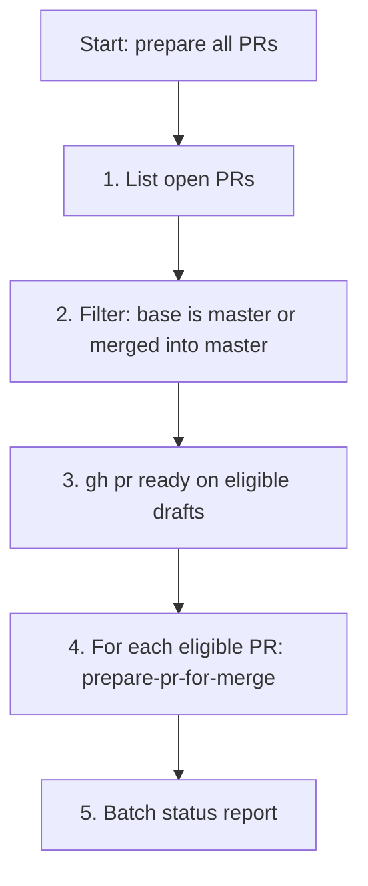

# Prepare All PRs for Merge

Use this skill when the user wants **every eligible PR** prepared for landing on
`master` — not one PR in isolation.

This skill is a **thin orchestrator**. It does not duplicate the per-PR logic in
[`prepare-pr-for-merge`](../prepare-pr-for-merge/SKILL.md). It discovers PRs,
filters by merge-base eligibility, marks drafts ready for review, then invokes
**`prepare-pr-for-merge`** once per eligible PR.

**You are the author** on each PR in the batch. You may edit code, rebase,
force-push, and update PR metadata. You are **not** merging PRs unless the user
explicitly asks.

## Workflow overview

Run these phases **in order**. Do not skip ahead.

| Phase | Action |
|-------|--------|
| 1 | Discover open PRs and filter to eligible merge-base |
| 2 | Mark eligible **draft** PRs ready for review (`gh pr ready`) |
| 3 | Run [`prepare-pr-for-merge`](../prepare-pr-for-merge/SKILL.md) on each eligible open PR |



## Phase 1 — Discover and filter PRs

### List open PRs

```bash
gh pr list --state open --json number,title,isDraft,baseRefName,headRefName,url
```

### Eligibility filter (mandatory)

**Include** a PR only if its merge base passes the same **stack readiness gate**
as [`prepare-pr-for-merge`](../prepare-pr-for-merge/SKILL.md#stack-readiness-gate-mandatory--run-first):

| `baseRefName` | Include? |
|---------------|----------|
| `master` | **Yes** |
| Any other branch | **Yes** only if that branch is already integrated into `master` |
| Any other branch (parent not on `master`) | **No** — skip and report |

For each non-`master` base, apply the parent checks from prepare-pr-for-merge:

1. **Primary:** `gh pr view "$base" --json state,mergedAt` — if `state` is
   `MERGED` (or `mergedAt` is set), the PR is eligible.
2. **Supplementary:** if no merged PR record exists:

   ```bash
   git fetch origin master "$base" --prune
   git merge-base --is-ancestor "origin/$base" origin/master
   ```

   Exit 0 → eligible; exit 1 → **skip**.

Record two lists:

- **`eligible`** — PRs to prepare (number, title, base, head, url, isDraft).
- **`skipped`** — PRs excluded because their stack parent is not on `master` yet
  (include blocking parent PR/branch in the report).

Do **not** retarget, rebase, or run prepare on skipped PRs.

### Processing order

Process **`eligible`** PRs in a sensible stack order:

1. PRs with `baseRefName: master` first (fewest dependencies).
2. Then PRs whose base branch is merged into `master` but still named as the
   feature branch (these will be retargeted to `master` during prepare).

Within each group, prefer **lower PR numbers first** (older / earlier stack
layers). This reduces repeated rebases when multiple stacked PRs become eligible
in one batch.

## Phase 2 — Draft → open (batch)

For every PR in **`eligible`** where `isDraft` is `true`:

```bash
gh pr ready <number>
```

Confirm `isDraft` is `false` before moving to Phase 3. This mirrors the
**Draft → open** step in prepare-pr-for-merge and ensures checks and reviews can
run.

Do **not** mark drafts ready if they failed the eligibility filter in Phase 1.

## Phase 3 — Prepare each eligible PR

For **each** PR in **`eligible`** (in processing order), load and follow
[`prepare-pr-for-merge`](../prepare-pr-for-merge/SKILL.md) **in full**:

- Stack readiness gate (should already pass — re-check if state changed).
- Draft → open (no-op if done in Phase 2).
- Retarget stacked PRs to `master`, rebase, resolve conflicts.
- **Babysit until green** — CI passing, no review in progress, blocking feedback
  addressed via `babysit`.
- Knit follow-up PR when applicable.

Treat each PR as a **separate sub-run**. Complete one PR's prepare workflow
(including babysitting to green) before starting the next, unless the user
explicitly asked for parallel work.

If prepare stops on a PR (unmerged parent discovered mid-run, ambiguous stack,
user input needed), **record the blocker**, skip or pause that PR, and continue
with the remaining eligible PRs unless the user said to stop on first failure.

## Phase 4 — Batch status report

Reply in chat with a summary table:

| PR | Base → target | Draft opened? | Prepared? | CI | Reviews | Ready? | Notes |
|----|---------------|---------------|-----------|-----|---------|--------|-------|
| #N | … | yes / n/a | yes / partial / skipped | … | … | yes / no | … |

Also list **`skipped`** PRs and why (e.g. stacked on unmerged `#M`).

**Do not merge** any PR unless the user explicitly asks.

## Boundaries

| Do | Do not |
|----|--------|
| Filter to master-base or merged-parent-base only | Prepare PRs blocked by an open ancestor |
| `gh pr ready` on eligible drafts before prepare | Mark ineligible drafts ready |
| Run full `prepare-pr-for-merge` per eligible PR | Reimplement rebase/babysit logic in this file |
| Babysit each PR until green before the next | Report batch "done" while checks fail |
| Report skipped PRs with blocking parent | Merge PRs without explicit instruction |

## Relationship to other skills

| Skill | Role |
|-------|------|
| **`prepare-pr-for-merge`** | Per-PR prepare workflow (invoked once per eligible PR). |
| **`babysit`** (Cursor built-in) | Used inside each prepare-pr-for-merge run. |
| **`pr-review-delivery`** | Reviewer-only — out of scope. |
| **`pick-up-work-item`** | Picks new work from issues — not for landing existing PRs. |
