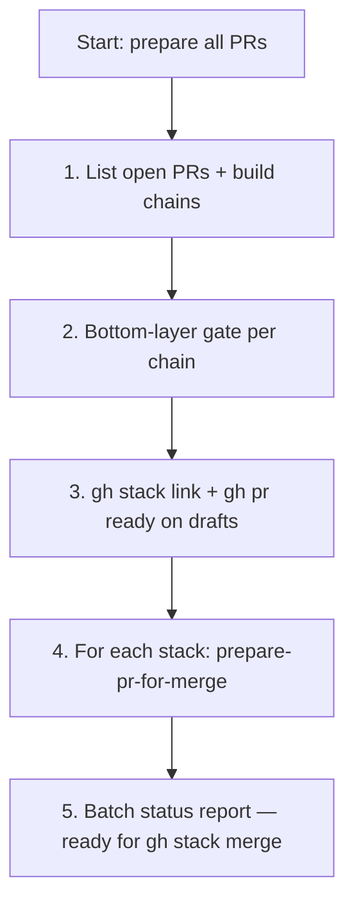

# Prepare All PRs for Merge

Use this skill when the user wants **every eligible PR** prepared for landing on
`master` — or when **`pick-up-work-item`** chose **Path A** because at least one
eligible PR **`needs_prep`** (draft, retarget/rebase, conflicts, failing CI, or
blocking review feedback).

This skill is a **thin orchestrator**. It does not duplicate the per-PR logic in
[`prepare-pr-for-merge`](../prepare-pr-for-merge/SKILL.md). It discovers PRs,
filters by merge-base eligibility, marks drafts ready for review, then invokes
**`prepare-pr-for-merge`** once per stack chain (bottom PR entry) or standalone PR.

**You are the author** on each PR in the batch. You may edit code, rebase,
force-push, and update PR metadata. You are **not** merging PRs unless the user
explicitly asks.

## Workflow overview

Run these phases **in order**. Do not skip ahead.

| Phase | Action |
|-------|--------|
| 0 | Ensure `gh extension install github/gh-stack` |
| 1 | Discover open PRs, build **stack chains**, filter by bottom-layer gate |
| 2 | Mark **draft** PRs ready for review on each stack (`gh pr ready`) |
| 3 | Run [`prepare-pr-for-merge`](../prepare-pr-for-merge/SKILL.md) **once per stack** (or per standalone PR) |


```mermaid
flowchart TD
  A[Start: prepare all PRs] --> B[1. List open PRs + build chains]
  B --> C[2. Bottom-layer gate per chain]
  C --> D[3. gh stack link + gh pr ready on drafts]
  D --> E[4. For each stack: prepare-pr-for-merge]
  E --> F[5. Batch status report — ready for gh stack merge]
```

## Phase 1 — Discover and filter PRs

**Run the script first** (do not hand-classify each PR):

```bash
./scripts/workflow/find-work.sh prs
```

Use `prepQueue` (oldest eligible PRs first), `needs_prep`, `merge_ready`, and
`stackBlockedOldestFirst` from the JSON — **never** rely on a raw `gh pr list`
without pagination (default limit 100 is newest-only and drops older open PRs).
For full path selection (Path A vs B/C), prefer `./scripts/workflow/find-work.sh path`.

### Manual fallback — list open PRs

```bash
gh pr list --state open --json number,title,isDraft,baseRefName,headRefName,url
```

### Build stack chains (mandatory)

`find-work.sh` marks only **bottom** layers as `eligible` and puts upper layers in
`skipped` — that is expected. For GitHub stacks, prepare **whole chains**, not
isolated `skipped` rows.

From **all** open PRs (eligible + skipped), build chains:

1. Map **`baseRefName` → child PR** for stacked layers (`baseRefName` ≠ `master`).
2. A **bottom** is any PR whose `baseRefName` is `master` or passes the
   **bottom-layer gate** in [`prepare-pr-for-merge`](../prepare-pr-for-merge/SKILL.md#3-bottom-layer-gate-mandatory),
   and whose `baseRefName` is not another open PR's `headRefName`.
3. From each bottom, walk up while a child PR exists with
   `baseRefName == current.headRefName`; record ordered `[#bottom, …, #top]`.
   (Same logic as `build_master_stack_chains` in `scripts/workflow/find_work.py`.)

Record:

- **`stacks`** — chains with ≥2 PRs (or a single PR that `needs_prep`).
- **`standalone`** — single PRs on `master` from `eligible`.
- **`blocked`** — chains whose bottom fails the gate (report blocking parent).

Do **not** prepare `blocked` stacks. Upper layers in a **ready** stack are
prepared together with the bottom even if `find-work` listed them under `skipped`.

### Eligibility filter (mandatory)

Apply the bottom-layer gate to each chain's **bottom PR only** (same rules as
prepare-pr-for-merge). Middle/top layers inherit eligibility from their stack.

| Bottom `baseRefName` | Prepare whole chain? |
|----------------------|----------------------|
| `master` | **Yes** (include all linked upper PRs) |
| Dependency branch integrated into `master` | **Yes** |
| Open parent not on `master` | **No** — `blocked` |

### Processing order

Process **`stacks`** and **`standalone`** PRs:

1. Chains whose bottom has the lowest PR number first (oldest stacks).
2. Within a chain, one `prepare-pr-for-merge` run from the bottom PR (full stack).

Use `gh stack link <bottom#> … <top#> --open` before sync when the GitHub stack
object does not exist yet.

## Phase 2 — Link stacks and draft → open (batch)

For each **`stacks`** entry (bottom → top):

```bash
gh stack link <bottom-pr#> ... <top-pr#> --open
```

For every PR in that chain (and each **`standalone`**) where `isDraft` is `true`:

```bash
gh pr ready <number>
```

Confirm `isDraft` is `false` on all layers before Phase 3.

Do **not** mark drafts ready on **`blocked`** chains.

## Phase 3 — Prepare each stack or standalone PR

For **each** stack chain or standalone PR (in processing order), load and follow
[`prepare-pr-for-merge`](../prepare-pr-for-merge/SKILL.md) **in full** — enter from
the **bottom** PR number so the whole chain is synced:

- Bottom-layer gate (re-check if state changed). When the bottom targets a branch
  whose commits are already on `master`, follow **Fix wrong stack base** in
  [`prepare-pr-for-merge`](../prepare-pr-for-merge/SKILL.md#fix-wrong-stack-base-unstack--retarget--relink)
  (`gh stack unstack` → `gh pr edit --base master` on the bottom → `gh stack link`
  → `gh stack sync`) — do not stop as "blocked" and do not retarget while still stacked.
- `gh stack checkout`, `gh stack sync` / `gh stack rebase` for multi-PR chains.
- **Babysit until green** on **every layer** — CI, reviews, `babysit`.
- Knit follow-up PR when applicable.
- Report **ready for maintainer `gh stack merge`** when the stack is green.

Complete one stack's prepare workflow (including babysitting all layers) before
starting the next, unless the user explicitly asked for parallel work.

If prepare stops on a PR (unmerged parent discovered mid-run, ambiguous stack,
user input needed), **record the blocker**, skip or pause that PR, and continue
with the remaining eligible PRs unless the user said to stop on first failure.

If the **entire batch** is a true no-op — all eligible PRs were `skipped` or
`merge_ready` before prep, and Path A made **zero commits** (nothing to fix) —
report that briefly and return control to
[`pick-up-work-item`](../pick-up-work-item/SKILL.md) to **fall through** to issue
triage (Path B/C).

If any eligible PR **remains `needs_prep`** after the batch (blocker, unresolved
requested-changes, ambiguous stack, user input needed, etc.), **do not** fall
through — report **`human action required`** and stop.

## Phase 4 — Batch status report

Reply in chat with a summary table:

| Stack / PR | Layers (#bottom…#top) | GitHub stack linked? | Prepared? | All CI green? | Ready for `gh stack merge`? | Notes |
|------------|------------------------|----------------------|-----------|---------------|-----------------------------|-------|

Also list **`blocked`** chains and why (bottom not on integrated trunk).

**Do not run `gh stack merge`** — agents lack merge permission; maintainer lands when green.

## Boundaries

| Do | Do not |
|----|--------|
| Group chains; `gh stack link` before sync | Prepare upper layers while stack bottom is blocked |
| `gh pr ready` on all layers in a stack | Mark drafts ready on blocked chains |
| Run full `prepare-pr-for-merge` per stack / standalone PR | Reimplement `gh stack` logic in this file |
| Babysit **every layer** until green | Report batch "done" while any layer fails checks |
| Report blocked stacks with parent | Run `gh stack merge` without permission |

## Relationship to other skills

| Skill | Role |
|-------|------|
| **`pick-up-work-item`** | Parent orchestrator — invokes this skill as Path A when eligible PRs `need_prep`; otherwise runs Path B/C for new work. |
| **`prepare-pr-for-merge`** | Per-stack prepare workflow (enter from bottom PR; babysit every layer). |
| **`babysit`** (Cursor built-in) | Used inside each prepare-pr-for-merge run. |
| **`pr-review-delivery`** | Reviewer-only — out of scope. |
